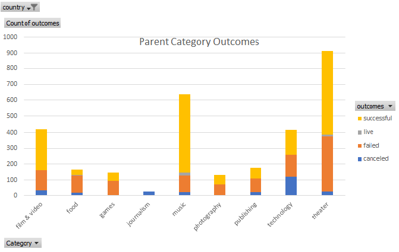
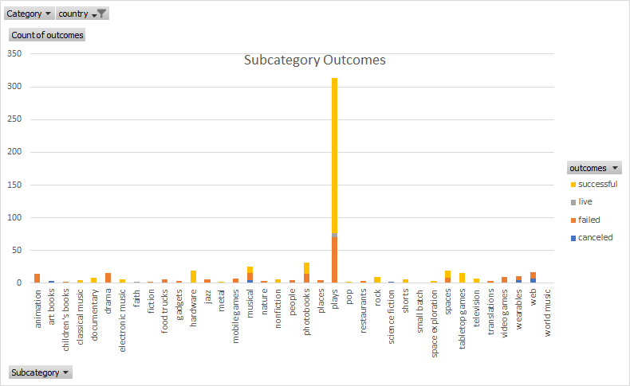
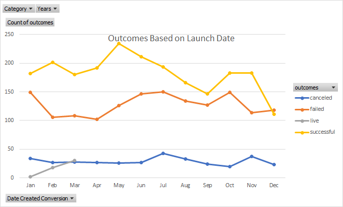
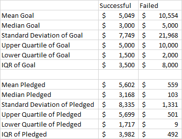
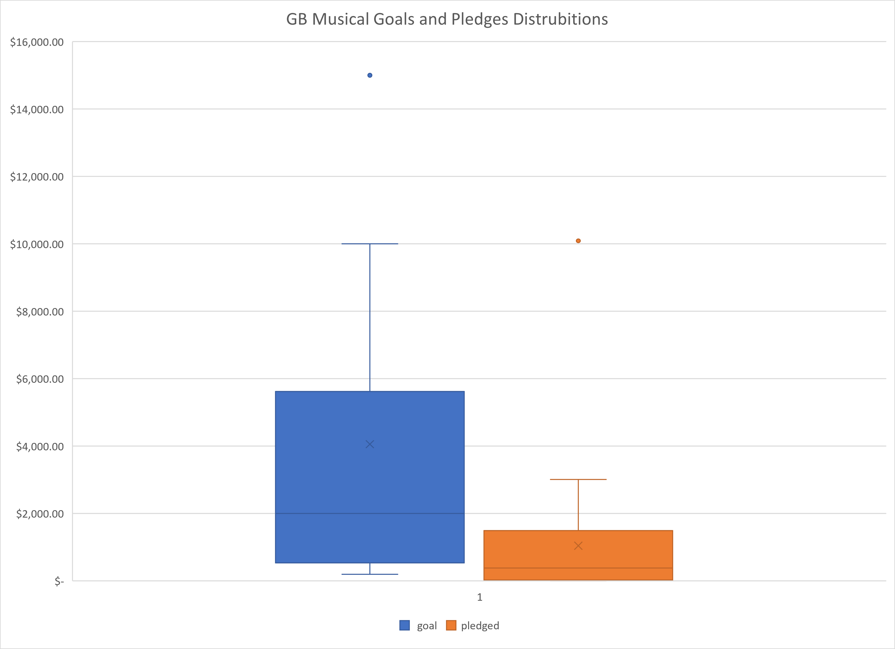

# An Analysis of Kickstarter Campaigns
Louise, I have performed an analysis Kickstarter campaigns that should provide insights for your Fever Kickstarter campaign. The analysis is based on a goal of $10,000.

## Kickstarter Data
Of 4,115 Kickstarter campaigns, 1,047 are Kickstarters for plays. Of those, 694 were successful in meeting their goals.

You can view the individual plays in the tab called Kickstarter. The outcomes have been color coded to make it easier to identify successful plays.

The excel sheet can be found [here](data-1-1-3-StarterBook.xlsx). 

## Are Theaterical Kickstarters Successful?

We see that theater projects are the most common kickstarter project, with slightly more than half being successful.

## Are Plays Specific Kickstarter Campaigns Successful?

Plays are the most common Kickstarter campaign by far and they tend to be successful!

## When is the Best Time to start a Kickstarter Campaign for Plays?

The most successful month of the year is May, but as summer continues, the odds of success get worst.

## Impact of Goal Amount On Campaign Success

Your goal of $10,000 is a concern. $10,000 was roughly the average value of kickstarter campaigns that failed. Sucessful campaigns are $5,000 or less.

## Great Britian Musicals

This boxplot shows the goal amounts vs the pledged amounts for musicals in Great Britian. The average goal was 4,000 pounds while 50% of campaigns were greater than 2,000 pounds. The average is above the most pledge amounts and the 2,000 pounds is above 50% of the pledged values. This suggest that people are too ambitous with their kickstarter goals for musicals.

## Recommendations
The kickstarter data suggest the following to maximize success:
*Reduce your goal to $5,000 or less
*Start your campagin in May
*Plays are tend to be sucessful and popular on Kickstarter

I wish you the best of luck for your campaign!
