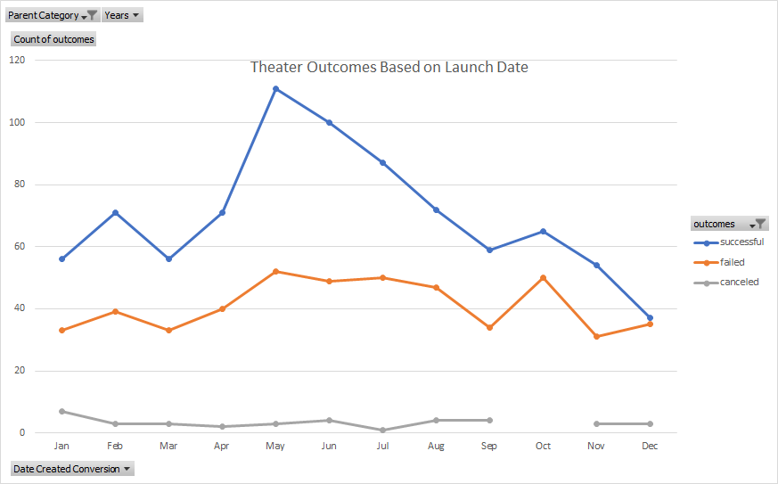
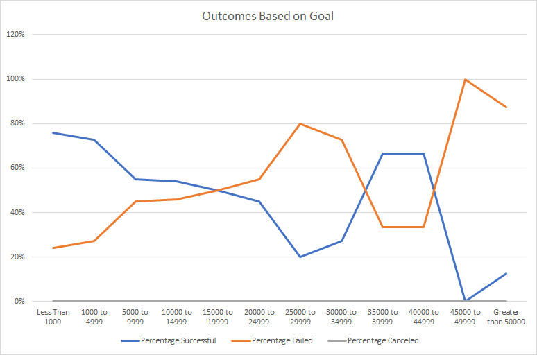

# Kickstarting with Excel

## Overview of Project
This project continues the analysis after Louise's play *Fever* failed to meet its goal on Kickstarter. She has asked how launch dates and / or funding goals impacted the success of other Kickstarter campaigns.

### Purpose
This analysis attempts to answer Louise's additional questions and to continue demonstrating skills in excel.

The primary goals are to provide an answer to Louise's questions:
1. Which is the best month to launch a successful kickstarter campaign.
2. Which goal amounts result in the most succesful kickstarter campaigns.

## Analysis and Challenges

### Analysis of Outcomes Based on Launch Date
Out of 4,114 Kickstarter campaigns, 1,369 **completed** theater campaigns were analysised by month created. The data was aggregated using a pivot table to filter by parent category and year. 

Campaign outcome defined the columns and values resulting in a count of successful, failed, and canceled campaigns for each month over several years.

The plot of Theater Outcomes Based on Launch Date is provided below:

### Analysis of Outcomes Based on Goals
Using COUNTIFS(), the campaigns were parsed into $5,000 bin sizes and further parsed and counted by successful, failed, or canceled.

The counts of successful, failed, and canceled were then used to compute the percentage of successful, failed, and canceled. Percentages were computed using the total counts within each $5,000 bin.

A line chart was then created using the percentages with $5,000 bins along the x-axis.

The plot of Outcomes vs Goals is provided below:

### Challenges and Difficulties Encountered
A challenge was encountered with COUNTIFS(). Most of the goal bins require an AND condition to test between two values. COUNTIFS() does not accept the excel function AND() in its criteria arguement. The only way to add boolen AND is to add the tested array again and a second criteria test. This was not obvious and allows bugs to enter the code.

## Results

- What are two conclusions you can draw about the Outcomes based on Launch Date?
1. The best month for success is May followed by June, July, and August.
2. The worst month to start a campaign is December.
3. The failure rate is constant throughout the year at about 40 failures a month.
4. The chance for success is greater than failure or canceling.

- What can you conclude about the Outcomes based on Goals?
1. Then general trend as goal increases, is chance of success decreases. To have a chance of 50% or greater for success, goals should be $1,500 or less.

- What are some limitations of this dataset?

1. One limitation of this dataset is that the goal amounts are in different currencies. Therefore, outcomes based on goal isn't a direct apples to apples comparison among the campaigns. The Outcome vs Goals plot should be filtered by country to compare similar currencies.

- What are some other possible tables and/or graphs that we could create?

1. An additional Outcomes Based on Launch Date filtered on the subcategory "plays" would be helpful identifiying times of year best suited for "plays".
2. As mentioned in the last question, graphs should be filtered by country to account for different currencies.
3. Either a table or a chart showing the number of backers by goal bin could be informative. Especially given that the general trend of success decrease as goal increases, but there are outliers in the 35,000 and 40,000 bin that buck this trend. It may be useful to understand if they had single large backers that made them successful.
